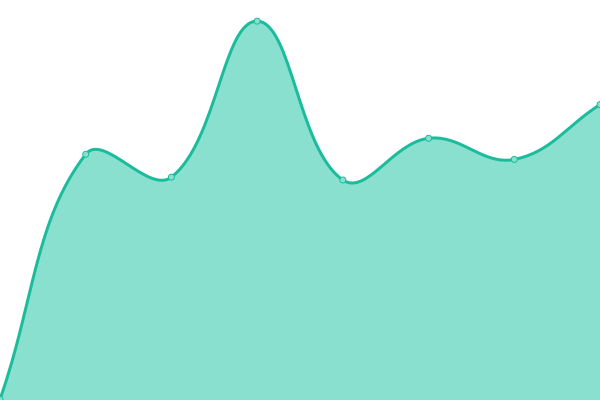
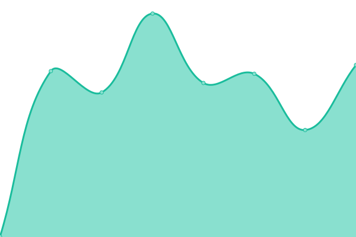

# [📈 Live Status](https://hackjack-101.github.io/upptime): <!--live status--> **🟧 Partial outage**

This repository contains the open-source uptime monitor and status page for [Jean "HackJack"](https://hackjack.info), powered by [Upptime](https://github.com/upptime/upptime).

With [Upptime](https://upptime.js.org), you can get your own unlimited and free uptime monitor and status page, powered entirely by a GitHub repository. We use [Issues](https://github.com/hackjack-101/upptime/issues) as incident reports, [Actions](https://github.com/hackjack-101/upptime/actions) as uptime monitors, and [Pages](https://hackjack-101.github.io/upptime) for the status page.

<!--start: status pages-->
<!-- This summary is generated by Upptime (https://github.com/upptime/upptime) -->
<!-- Do not edit this manually, your changes will be overwritten -->
<!-- prettier-ignore -->
| URL | Status | History | Response Time | Uptime |
| --- | ------ | ------- | ------------- | ------ |
|  [Personal website](https://hackjack.info) | 🟩 Up | [personal-website.yml](https://github.com/HackJack-101/upptime/commits/HEAD/history/personal-website.yml) | 

 814ms
     
 | 

<a href="https://hackjack-101.github.io/upptime/history/personal-website">100.00%</a>
    

|  [Company website](https://kbdev.io) | 🟥 Down | [company-website.yml](https://github.com/HackJack-101/upptime/commits/HEAD/history/company-website.yml) | 

 565ms
     
 | 

<a href="https://hackjack-101.github.io/upptime/history/company-website">0.00%</a>
    

|  Personal Nextcloud | 🟩 Up | [personal-nextcloud.yml](https://github.com/HackJack-101/upptime/commits/HEAD/history/personal-nextcloud.yml) | 

 1058ms
     
 | 

<a href="https://hackjack-101.github.io/upptime/history/personal-nextcloud">100.00%</a>
    

|  Company Nextcloud | 🟩 Up | [company-nextcloud.yml](https://github.com/HackJack-101/upptime/commits/HEAD/history/company-nextcloud.yml) | 

 853ms
     
 | 

<a href="https://hackjack-101.github.io/upptime/history/company-nextcloud">100.00%</a>
    

|  Company RochetChat | 🟩 Up | [company-rochet-chat.yml](https://github.com/HackJack-101/upptime/commits/HEAD/history/company-rochet-chat.yml) | 

 769ms
     
 | 

<a href="https://hackjack-101.github.io/upptime/history/company-rochet-chat">100.00%</a>
    

|  [Stream[ON]](https://streamon.info) | 🟩 Up | [stream-on.yml](https://github.com/HackJack-101/upptime/commits/HEAD/history/stream-on.yml) | 

 679ms
     
 | 

<a href="https://hackjack-101.github.io/upptime/history/stream-on">100.00%</a>
    

|  Advanced search on Google | 🟥 Down | [advanced-search-on-google.yml](https://github.com/HackJack-101/upptime/commits/HEAD/history/advanced-search-on-google.yml) | 

 731ms
     
 | 

<a href="https://hackjack-101.github.io/upptime/history/advanced-search-on-google">0.00%</a>
    

|  Seedbox | 🟩 Up | [seedbox.yml](https://github.com/HackJack-101/upptime/commits/HEAD/history/seedbox.yml) | 

 1059ms
     
 | 

<a href="https://hackjack-101.github.io/upptime/history/seedbox">100.00%</a>
    

<!--end: status pages-->

[**Visit our status website →**](https://hackjack-101.github.io/upptime)

## 📄 License

- Powered by: [Upptime](https://github.com/upptime/upptime)
- Code: [MIT](./LICENSE) © [Jean "HackJack"](https://hackjack.info)
- Data in the `./history` directory: [Open Database License](https://opendatacommons.org/licenses/odbl/1-0/)
